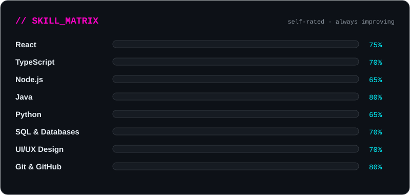
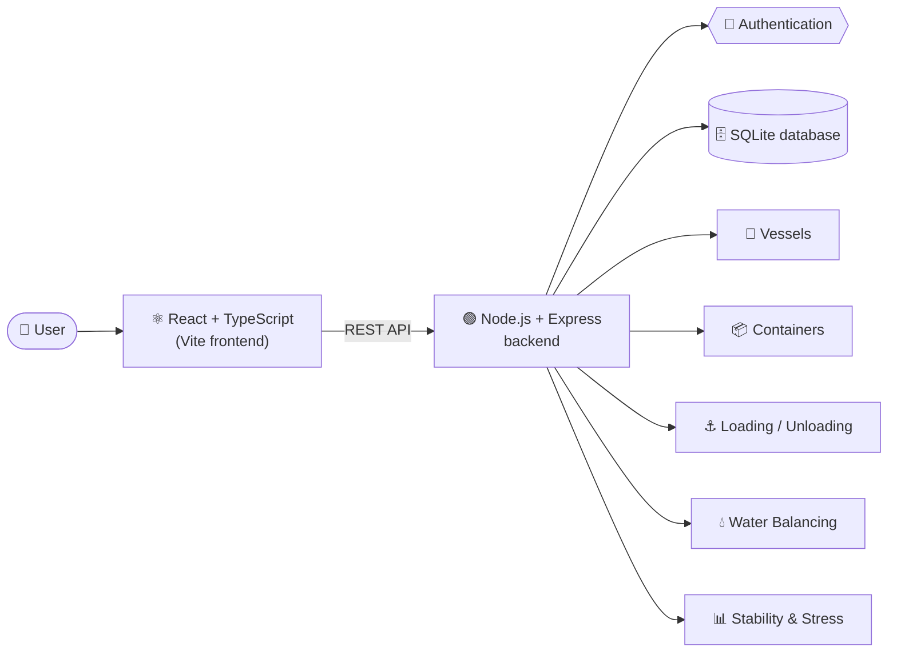
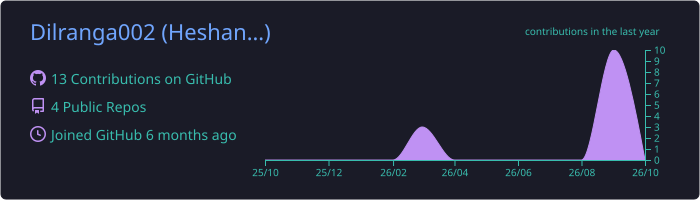
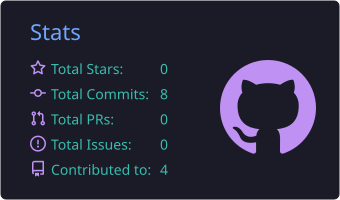
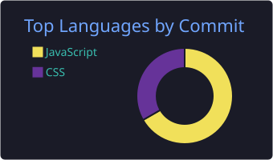
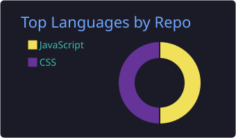
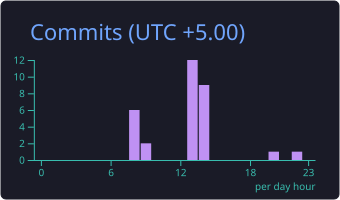
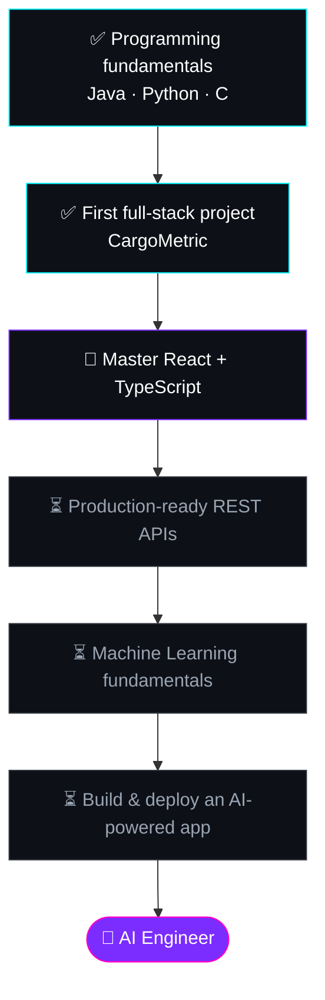

<div align="center">




<br>


<br><br>

<a href="#about"></a>
<a href="#stack"></a>
<a href="#project"></a>
<a href="#stats"></a>
<a href="#roadmap"></a>
<a href="#contact"></a>

</div>


<a id="about"></a>

# 👨‍💻 About Me

<div align="center">

### Hello! I'm **Heshan Dilranga** 

*I turn ideas into working software, one commit at a time.*

</div>

I'm a **Software Engineering student** passionate about building modern, useful and user-friendly software. I enjoy taking an idea from a simple concept all the way to a working application, from the database and API to the interface people actually use.

I believe good software is built through **continuous learning, problem solving, teamwork, testing and improvement.**

<div align="center">

</div>

### 🧭 Right Now

| | |
| :-- | :-- |
| 🔭 **Building** | **CargoMetric**, a maritime cargo management system |
| 🌱 **Learning** | React, TypeScript, Node.js, Java, Python, databases |
| 🤖 **Exploring** | AI & Machine Learning |
| 🎨 **Improving** | UI/UX design and clean, responsive interfaces |
| 🎯 **Goal** | Become a skilled **AI Engineer** who designs, builds and deploys intelligent software |

---

<a id="stack"></a>

# 🛠️ Tech Stack

<div align="center">

</div>

<div align="center">

**Languages**<br>


**Web Development**<br>


**Databases**<br>


**Tools**<br>


</div>

### ⚡ What I Do

<div align="center">

| 💻 Software Engineering | 🌐 Full-Stack Development |
| :---------------------: | :-----------------------: |
| Designing scalable software | Building modern web applications |
| Problem solving | REST APIs & backend systems |
| Testing & debugging | Database integration |

| 🎨 UI/UX Design | 🤖 Artificial Intelligence |
| :-------------: | :------------------------: |
| User-centered interfaces | Exploring Machine Learning |
| Responsive designs | Python & AI development |
| Figma & prototyping | Intelligent applications |

</div>

---

<a id="project"></a>

# 🚢 Featured Project

<div align="center">

## ⚓ CargoMetric
### Maritime Cargo Loading & Management System


<br>

<a href="https://github.com/Dilranga002/Navigation_project">


</a>

</div>

**CargoMetric** is a web-based maritime cargo management system for managing vessels, containers, cargo loading/unloading operations, water balancing and vessel stability.

### 🧩 Architecture



### ✨ Key Features

| Feature | What it does |
| :------ | :----------- |
| 🚢 **Vessel Management** | Add, view and manage vessels and their details |
| 📦 **Container Management** | Track containers and their properties |
| ⚓ **Cargo Loading** | Plan and perform cargo loading operations |
| 📤 **Cargo Unloading** | Handle unloading operations safely |
| 💧 **Water Balancing** | Balance ballast water to keep the vessel steady |
| 📊 **Stability Monitoring** | Monitor vessel stability during operations |
| 📈 **Stress Monitoring** | Keep an eye on stress levels on the vessel |
| 🔐 **Authentication** | Secure login for authorized users |

<div align="center">

</div>

<details>
<summary><b>🚀 Run CargoMetric locally</b></summary>

<br>

```bash
# 1. Clone the repository
git clone https://github.com/Dilranga002/Navigation_project.git

# 2. Move into the project folder
cd Navigation_project

# 3. Install dependencies
npm install

# 4. Start the development server
npm run dev
```

</details>

<div align="center">
<a href="https://github.com/Dilranga002/Navigation_project">

</a>
</div>

---

<a id="stats"></a>

# 📊 GitHub Analytics

<div align="center">









<br>


<br>


</div>

---

<a id="roadmap"></a>

# 🗺️ Roadmap



### 🧠 Learning Path

```text
                    ┌────────────────────┐
                    │ SOFTWARE ENGINEER  │
                    └─────────┬──────────┘
                              │
        ┌─────────────────────┼─────────────────────┐
        │                     │                     │
        ▼                     ▼                     ▼
   ┌──────────┐          ┌──────────┐          ┌──────────┐
   │ FRONTEND │          │ BACKEND  │          │    AI    │
   └────┬─────┘          └────┬─────┘          └────┬─────┘
        │                     │                     │
        ▼                     ▼                     ▼
      React                Node.js               Python
      Vite                 Express                 ML
    TypeScript             REST API                AI
      UI/UX                Database               Data
```

### 🔁 Developer Loop

<div align="center">

</div>

### 🌱 Beyond Code

<div align="center">

`🤝 Teamwork` • `🎨 UI/UX` • `🧠 Problem Solving` • `📚 Learning`

`🏆 Leadership` • `⏱️ Time Management` • `🚀 Innovation`

</div>

---

<a id="contact"></a>

# 📫 Connect With Me

<div align="center">

<a href="https://github.com/Dilranga002">

</a>
<a href="https://www.linkedin.com/in/YOUR-LINKEDIN-ID">

</a>
<a href="mailto:YOUR_EMAIL@example.com">

</a>

<br><br>


</div>
